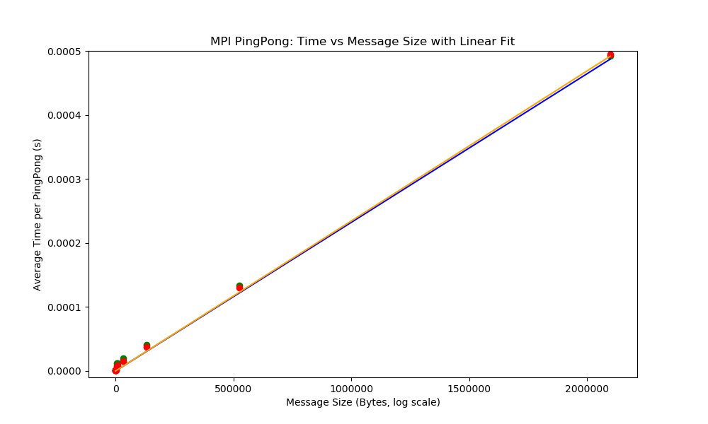

# Week 4 - MPI Communications

## Part 1: Demonstrating communications

The first step in part 1 required testing of the comm_test_mpi.c program. I ran it for a varying number of processors to observe its behaviour.
After compiling the program I executed:
> "mpirun -np 4 comm_test_mpi"
> "mpirun -np 6 comm_test_mpi"
> "mpirun -np 8 comm_test_mpi"

***Observations:***
The results across all three tests was consistent.
Firstly, the order in which the client completed their sent varies between runs. In none of the runs did the clients complete their sending in their "order" meaning the "Hello, I am x of 4. Sent 10*x to Rank 0" never occured in sequential rank order.
They also never occured in the same pattern and was always random. This isn't an indication that the MPI function is running incorrectly but instead shows that MPI processes execute independently, something we were expecting.
Despite the varying send order, Root always recieves the messages in squential rank order. 1 being first and (uni_size - 1) being last. This occurs due to the root process having a for loop which calls the MPI_Recv() function in order.
This does however demonstate that MPI_Send() can return values before the reciever (root 0) even calls them.

***Improving the code:***
The next step was to break the code intp manageable functions, each handling a single task instead of a complicated and hard to follow single main() fucntion.
Using proof.c from week 1 I split the script into 4 main functions.
>***check_uni_size*** - This function ensures that there are enough given processes for the MPI function to work. At leat 2 processes, root and one client are need for this to work.
>***root_task*** - The root function uses MPI_Recv to collect all the messages being sent from the clients. It runs a for loop to recieve each message in sequential order from its clients and then prints that it has recieved the meassge.
>***client_task*** - Client task simply sends its message (its rank * 10) to the root function, and informs us that it has done so.
>***perform_task*** - The final task checks the rank of the process and tells it which action to preform depedning on its rank.

***Experimenting with send types:***
Next a new file was created, MPI_variants.c.This script is a copy of "my_comm_test_mpi.c" but including different MPI sending methods within the client task.
Rather than making an 5 identical scripts with small changes in the clinet task for the different methods, I made a script with all 5 methods present and commented out the methods not being used when compiling the code.
Additionally, I tracked the time it took each method to send its data to root, to track the difference in methods.
Two issues arose during the implementation of the different methods.
1). Bsend requires a user defined buffer to store messages in before they are transmitted to root. This is different than what was previously seen for Send and Ssend.
2). Isend also displayed some difficulties due to its characteristics. Since Isend is nonblocking it starts sending an immediately returns, before MPI_Wait was implemented all the messages weren't completing each run.

MPI_Rsend ran without any issues. The documentaion suggested that Rsend may cause the program to crash as it assumes the receiver is already waiting when the send is called, meaning if root has not yet called MPI_Recv when the client calls Rsend a error could occur.
In my testing this issue never arose.

***Behaviour observations of different MPI sending methods:***
All variants of the MPI communication worked once the issues with B and Isend were fixed. As observed earlier with MPI_send, the order of the send completion messages varried between runs.
However, the timing results showed noticable differences between the different methods. MPI Send Bsend Rsend and Isend all had similar transmission times, with MPI_Isend being the quickest.
While Isend is the fastest, there is a small difference between the four methods mentioned, Ssend however is noticably slower. This is due to its synchronous nature. As discussed in the lecture and lecture slides, MPI_Ssend sends the message to a buffer and waits for acknowledgment before it sends. Since root receives the messages in order from 1 - N (where N is the amount of clients) the later clients slow the process down.
This can be observed by running "mpirun -np 12 MPI_variants_Ssend".
Looking at the results of this we first observe "Rank 1 took 0.0002913920 seconds to send" and then for rank 11 we see "Rank 11 took 0.0006394130 seconds to send".

***Benchmarking results***
Using the internal timing feature, the following results were recorded from the execution of, "mpirun -np 12 MPI_variants_[SendType]"

| Send Type | Rank 1 (s) | Rank 5 (s)  | Rank 11(s)     |
|-----------|------------|-------------|----------------|
| MPI_Send  | 0.000018   | 0.000016    | 0.000022       |
| MPI_Ssend | 0.000111   | 0.000295    | 0.000597       |
| MPI_Bsend | 0.000022   | 0.000019    | 0.000023       |
| MPI_Rsend | 0.000018   | 0.000015    | 0.000032       |
| MPI_Isend | 0.000009   | 0.000014    | 0.000016       |

As discussed previously, MPI_Ssend is clearly the slowest of the five methods, with time increasing for higher ranks.
MPI_Isend is the fastest on average, though the performance between the four is relatively small.
Considering both performance and complexity of applying the method, MPI_Send is the best choice. It provides near speeds of MPI_Isend with minimal additional setup. Similarly, it doesn't provide any of the potential errors that could come with Rsend if the timings dont work.

## Part 2: Benchmarking latency and bandwidth 

***Writing the pingpong program:***
The first step of part two was to implement a "ping pong" communication program. The purpose of the program is to measure the average time average time required to send two messages back and forth between a root and a client.
The program was developed using the following logic.

-Check the user has inputted an amount of pingpongs in there command line
-Ensure there is exactly 2 processes being used
-Start the root task to perform it's task
	-Initialise a counter to 0
	-Start a loop while counter is less than the inputted amount of pingpongs
		-Root sends a ping to the client
		-Root recieves a pong back from the client  
	-Once the loop ends send a final ping to client to make sure it sends its own loop
-Have the client task perform its task when called
	-Create counter variable
	-Start an infinite loop to and recieve the ping sent from root
	-Check if the counter sent by root is greater than or equal to the user input of number of ping pongs
		-If counter is less than pingpongs, increase counter by one and send pong back to root
		-If counter is greater or equal to pingpongs exit the infinite loop.
-Have a function to decide what process each rank should perform

***Measuring latency***
Once the program was finished it was then compiled and executed using:
	"mpicc pingpong.c -o pingpong"
	"mpirun -np 2 pingpong [num of pings]"

The following results were recorded:

| Number of Pings | Runtime (s) | Average Time per PingPong (s) |
|-----------------|------------:|------------------------------:|
| 1               | 0.000155    | 0.000155                      |
| 100             | 0.000260    | 0.000003                      |
| 1,000           | 0.000823    | 0.000001                      |
| 10,000          | 0.008470    | 0.000001                      |
| 100,000         | 0.056320    | 0.000001                      |
| 1,000,000       | 0.542977    | 0.000001                      |
| 10,000,000      | 5.532076    | 0.000001                      |
| 100,000,000     | 53.884120   | 0.000001                      |

At small number of pingpong the average time is relativly high compared to other values of pingpong. As the number of ping increased to 100 and 1000 the average time per pingpong decreases.
From here as pings increase to larger and larger values the average time converges to 0.000001 seconds, or 1 microsecond.
The runtime increases lineary but the average time per pingpong remains constant. This shows that at large values of pings the noise of overhead activities is reduced.

We can use this converaged value to find the latency of the system. Latency is the time it takes for a system to be passed and recieved from one point to another. Since our average time is for a whole round trip we can half it to find the latency of the system.
1/2 = 0.5microseconds.

These results show:
	-When sendings data back and forth a few times, overhead behaviour dominates the time.
	-When the iterations increase to larger values, timing converages to a stable average time.
	-Runtime increases proportionally with the number of pingpongs inputted.

***Measuring bandwidth***

Next the pingpong program was modified to measure the bandwidth of the system by transmitting an array of variable size. This required developing a new program that takes an additional command-line argument to specify the desired message size(in bytes).
Using week threes program vector_serial.c an array was initialised using malloc().
The array was sent back and fourth between root and client using the same structure as the pingpong.c program. This program however uses the first index of the array as the counter.
An additional condition was added to the check_args function, the new condition ensures that the message size (argument three) is at least the size of the smallest message possible (4 bytes).

The program was then executed using:
	"mpirun -np 2 pingpong_bandwidth [num of pingpongs] [array size]

Based on the results of pingpong.c it was clear that a value greater than 1000 was need for the number of pingpongs to ensure convergence.

First run (num of pings = 1,000):

| Message Size (B) | Array Elements| Runtime (s) | Avg Time/Pingpong (s)|
|----------------- |---------------|------------ |--------------------- |
| 16               | 4             | 0.001430    | 0.000001             |
| 64               | 16            | 0.001231    | 0.000001             |
| 256              | 64            | 0.001490    | 0.000001             |
| 1034             | 258           | 0.002447    | 0.000002             |
| 4096             | 1024          | 0.012135    | 0.000012             |
| 8192             | 2048          | 0.011737    | 0.000012             |
| 32768            | 8192          | 0.019769    | 0.000020             |
| 131072           | 32768         | 0.041154    | 0.000041             |
| 524288           | 131072        | 0.132823    | 0.000133             |
| 2097152          | 524288        | 0.491716    | 0.000492             |

Second run (num of pings = 100,000)

| Message Size (B) | Array Elements| Runtime (s) | Avg Time/Pingpong (s)| 
|----------------- |---------------|------------ |--------------------- |
| 16               | 4             | 0.078846    | 0.000001             | 
| 64               | 16            | 0.066258    | 0.000001             | 
| 256              | 64            | 0.082274    | 0.000001             |
| 1024             | 256           | 0.140812    | 0.000001             |
| 4096             | 1024          | 0.787361    | 0.000008             |
| 8182             | 2045          | 0.907413    | 0.000009             |
| 32768            | 8192          | 1.500914    | 0.000015             | 
| 131072           | 32768         | 3.826012    | 0.000038             |
| 524288           | 131072        | 12.977212   | 0.000130             |
| 2097152          | 524288        | 49.516397   | 0.000495             |

The average time was plotted against the message size of the array in bytes. Assuming the y-axis is average time per pingpong and the x-axis is the array size, the y-interceot corresponds to the latency as it is the time value when the array is size 0.
We can then say the slope is 1/bandwidth, since the slope desribes how much extra time is need per extra data. Bandwidth was then found using 1/slope.

The first run procduced a the following results:
	-Latency: 6.496 μs
	-Bandwidth: 4305.78 MB/s
The second run:
	-Latency: 4.281 μs
        -Bandwidth: 4305.78 MB/s

Latency decreases with the amount of pingpongs assigned by the user, this is consistent with the results of the original pingpong experiment.
The bandwidth remains the same across both runs, slightly varying in value. This is expected as bandwidth doesn't change across iterations.

## Part 3: Collective Communications

Part three of this weeks task saw the replacement of point to point communications with MPI collective communications. Using the program for vector addition from week three, a new method a communication was implemented to test which method would be the fastest.
To test how performance increases 3 tests were benchmarked:
	-Distribution using MPI_Send and MPI_Recv (week 3)
	-Distribution using MPI_Bcast
	-Distribution using MPI_Scatter

To track the consistency and correctness across the different communcication methods, a verification check was used to ensure at each step and implementation the correct result was being produced.
An array size of 10 was used as a test case for all scripts as its expected sum is easy to remember so the output of each program can be easily verified.
At each change of method and change in logic a test would be performed on the compiled code to ensure 55 was still being produced. Once it was verified the development/benchmarking could continue.

***Expected performance and benchmarking Broadcast vs Scatter vs week3 Vector_addition:***
Before running the benchmarks I expected that MPI_scatter would provide the best performance. This is becuase it only requires a portion of the array to be distributed to each process. Bcast requires the entire array to be sent to each process.

First test (number of processes = 4):

| Test Type            | N (Array Size) | Runtime (s) |
| -------------------- | -------------- | ----------- |
| Point to point       | 1,000,000      | 0.005118    |
| MPI_Scatter          | 1,000,000      | 0.004166    |
| MPI_Bcast            | 1,000,000      | 0.008283    |
| Point to point       | 10,000,000     | 0.031823    |
| MPI_Scatter          | 10,000,000     | 0.031104    |
| MPI_Bcast            | 10,000,000     | 0.064408    |

Second test (number of processes = 8):

| Test Type            | N (Array Size) | Runtime (s) |
| -------------------- | -------------- | ----------- |
| Point to point       | 1,000,000      | 0.003587    |
| MPI_Scatter          | 1,000,000      | 0.003218    |
| MPI_Bcast            | 1,000,000      | 0.008388    |
| Point to point       | 10,000,000     | 0.026860    |
| MPI_Scatter          | 10,000,000     | 0.026968    |
| MPI_Bcast            | 10,000,000     | 0.079907    |

AS expected MPI_Scatter outperformed MPI_Bcast in all cases, as discussed this makes sense, instead of sending a massive array to each chunk scatter only sends the needed information.
The benchmarking shows that point to point and MPI_Scatter performed very similarly across both tests. For 4 processes the point to point took slightly longer than scatter for an array of size 1 million, but when it was increased to 8 processors the performance was practically the same. 
The marginal advantage of scatter is likely due to it having built in distribution processes compared to the manual send loop required for point to point.

***Send/Recv vs Gather vs Reduce***

In this step the goal was to now explore different MPI communication methods and how the effect the performance of a specific task. The baseline implementation was the simple scatter with a send/recv point to point communication. 
The two alternative collective communication methids that were used were
	-MPI_Gather - This works by gathering the partial sums from the client processes and putting them into an array.
	-MPI_Reduce - This method collects the partial sums but also performs the addition of all the sums as part of the process.

The two programs "vector_scatter_reduce.c" and "vector_scatter_gather.c" were created by taking the "vector_scatter.c" and making slight adjustments for the new MPI operations.
	-MPI_Gather uses the gather function instead of recv. Since gather puts all the partial sums into an array a buffer was allocated within the root_task fucntion to accomodate this. The root_task also needs a new loop to sum all the values within the gathered array. The only other change needed was replacing the send function in the client task with the gather function.
	-MPI_Reduce simiarly, replaces send with its own operation. This operation however does not need an array to hold the partial sums, it also doesnt need a loop to sum all the partial sums together, it does all this with the MPI_SUM fucntion.

Based on the theory and code, I would expect Reduce to be the fastest method overall. Since the sum is done within the operation the this removes the time needed to loop through the results. As for Gather and Send/Recv I would expect them to potentially take the similar time as they perform similar task.

To benchmark the results I used MPI_Wtime as used in the other programs. The inital test was as follows;
Run each program with the same amount of processes, varying the size of the array between runs. 
	>"mpirun -np 4 vector_scatter 10"
	>"mpirun -np 4 vector_scatter_gather 10"
	>"mpirun -np 4 vector_scatter_reduce 10"

Results: (num of processes = 4)

| Method         | N (Array Size) | Runtime (s) |
| -------------- | -------------- | ----------- |
| Scatter        | 10             | 0.000183    |
| Scatter_gather | 10             | 0.000096    |
| Scatter_reduce | 10             | 0.000084    |
| Scatter        | 100            | 0.000152    |
| Scatter_gather | 100            | 0.000117    |
| Scatter_reduce | 100            | 0.000090    |
| Scatter        | 1,000          | 0.000230    |
| Scatter_gather | 1,000          | 0.000094    |
| Scatter_reduce | 1,000          | 0.000090    |
| Scatter        | 100,000        | 0.000678    |
| Scatter_gather | 100,000        | 0.000652    |
| Scatter_reduce | 100,000        | 0.000664    |
| Scatter        | 1,000,000      | 0.004041    |
| Scatter_gather | 1,000,000      | 0.004510    |
| Scatter_reduce | 1,000,000      | 0.003722    |

For small values of N the reduce method proved to be marginally faster than gather and both were quicker than Send/Recv. As the array size increased the reduce remained quicker until the three methods begin to converge around 10,000/100,000. 
I wasn't expecting this result, I thought regardless of array size the process of reduce would remain quicker for any array size.
A reason for this could be for larger arrays the time spent performing calculations is much greater than that of the communication time between processes. So, as the array grows the communication time becomes small enough that it doesn't matter in the overall runtime causing the convergance we see.

***My own reduce operation***

The goal of the final part of the assignment was to create my own MPI operation that performed the same functionality as MPI_SUM and to then compare its performance and accuracy with the predefined operation given my MPI.

This script is a copy of the "vector_scatter_reduce.c" program with some altercations to meet the needs of the task.
	-MPI operation: First the operation was created using MPI_Op_create which takes three arguments.
		>The fucntion that performs the operation
		>A number which informs MPI if the operation is commutative or non commutative 
		>An operation name which is defined using MPI_Op [name]
	-Similar to allocated buffers for malloc, once the operation is performed the MPI operation needs to be released with MPI_Op_free.
	-The function perfroming the actual operation is also needed. The function in this case is my_MPI_SUM_function. 
		-The function takes four arguments:
			>pointers to the input, the new values from a process, and to the output, the current accumlated sum.
			>int len tells the function how many elements are going to be coming into the function
			>*datatype tells the MPI function what type of data is being used.
		-Inside the function we use long long to avoid overflow for large arrays, ensuring the results remain accurate. This creates in and out which the function then loops over from 0 to length of the elements and adds all the values to out, the accumulated total.

Once the script was finish it was compiled with mpicc and it was benchmarked againts the MPI_SUM used in "vector_scatter_reduce.c".

Results:
Test ran: "mpirun -np 4 [mpi_scatter_reduce/my_reduce_operation] [10 -> 100,000,000]

| Method     | N (Array Size) | Runtime (s) | Accuracy         |
| ---------- | -------------- | ----------- | ---------------- |
| my_MPI_SUM | 10             | 0.000079    | 55               |
| MPI_SUM    | 10             | 0.000121    | 55               |
| my_MPI_SUM | 100            | 0.000202    | 5050             |
| MPI_SUM    | 100            | 0.000105    | 5050             |
| my_MPI_SUM | 1,000          | 0.000193    | 500500           |
| MPI_SUM    | 1,000          | 0.000166    | 500500           |
| my_MPI_SUM | 10,000         | 0.000284    | 50005000         |
| MPI_SUM    | 10,000         | 0.000254    | 50005000         |
| my_MPI_SUM | 100,000        | 0.000669    | 5000050000       |
| MPI_SUM    | 100,000        | 0.000629    | 5000050000       |
| my_MPI_SUM | 1,000,000      | 0.004925    | 500000500000     |
| MPI_SUM    | 1,000,000      | 0.004388    | 500000500000     |
| my_MPI_SUM | 10,000,000     | 0.031204    | 50000005000000   |
| MPI_SUM    | 10,000,000     | 0.030395    | 50000005000000   |
| my_MPI_SUM | 100,000,000    | 0.309536    | 5000000050000000 |
| MPI_SUM    | 100,000,000    | 0.303566    | 5000000050000000 |

My operation produced the same results as the built in operation confirming its accuracy. For all array sizes my operation performs slightly slower than MPIs built in version. This is expected as I assume MPI have further optimised their version.
As the array size grows so does the differnce between times, at very large values for N the performance gap would become more significant.

