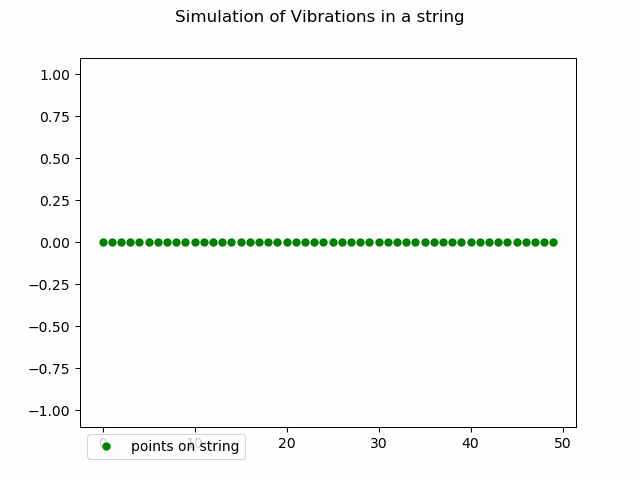

# Week 5 - Communications and Topologies

## Overview:

This weeks assignmenet involved implementing taking a given C based simulation of an ideal oscillation of a string. The goal of the assignment is to take a serial implementation of the simulation with hard coded paramters, to a version which takes user paramaters to build the osccilations.
The core challange involved converting the program from a serial problem to a parallel one. The string is split into chunks where each processes indevidually calcaultes updates for its own section. This should ideally improve the speed of the program.
Finally, the physics of the system is improved so that it more accuratly represents a physical system. The simple propogation of the original program was replaced with a strong which operates under Hookes law (F = -km).

## Part 1: Serial Code

This section of the assignement will make use of the `string_wave.c` given as part of this weeks tasks. The program simualted an oscillating string by simualting and tracking the position of points across the string. Each time_step within the program the first point is the "driver" and each point after that takes the value of the one before it. The rest of the functions work at ensuring the physics works smoothly and that the data is saved to a csv.

To compile the code for this section:
	- `gcc string_wave.c -o bin/string_wave -lm`

The -lm in needed for this program to comiple. The math.h library is included in the script and the compile needs -lm as an argument to bound it to the compiler.

Once the script is compiled and the binary file exists the csv file can be generated using:
	- `./bin/string_wave [points]`

When this is ran, the program is going to create a string_wave.csv file in the data directory, if this directory doesn't exist the file will not execute properly and will crash. Ensure there is a directory called "data" so the csv file can be generated.
The "points" command line argument desides how many unique elements (points) are along the strong. 
The amount of cycles, samples and the name of the output file is currently hardcoded into the script so this is something you don't need to be concerned with when running the file at this point.

As a final step for the serial code, the output can be visualised using the give script `annimate_line_file.py`. Thus file takes the csv, and uses the data to produce a gif of the osccialting string. To generate this run:
	- `python3 HPQC/week5/animate_line_file.py data/string_wave.csv`

Running this line will generate a gif called ` .gif` in the data directory. Running this on cheetah was difficult for me as I was having an issue with a graphical interface. To get around this, I used ran the following line from my powershell:
	-`scp -J [username]@www.physics.dcu.ie [username]@cheetah.physics.dcu.ie:~/data/animate_string_file.gif [location on personal computer]` 

This will prompt you to input you frank/cheetah password, and once entered will download the gif onto your Windows PC. From here the gif will be viewable in full. The correct output will show an oscilating sin wave from right to left.

**Removing the hardcoded aspects of the script:**

Next I a new script `my_string_wave.c` was created. The idea of this script was to take the logic and function of the previous `string_wave_serial.c` and update it so that it no longer had hardcoded paramaters but instead they could be selected by the user, like for the "points" paramater.
The development of this was simple enough, rather than reading in a single argument I updated it so that the program expected 4 inputs, points, cycles, sample and output_file name. Now, after compiling the code the same was as before, we can now run:
	-`./bin/string_wave [points] [cycles] [sample] [filename]`

This makes it much easier to control what sort of wave data is produced.

Similaraly, `animate_line_file.py` was updated with a function that requests the user for an input when ran. The input prompts the user the input the name of gif they wish to create. This again aids in creating different gifs for comparing.

## Part 2: MPI

The second part of this weeks task was to parallelise the simulation using MPI so that multiple processes can handle different segments of the string simultaneously. I was unable to successfully implement this correctly but my attempt located in 

## Part 3: Improve Physics model

The original `string_wave.c` simulation used a simplified model of a string oscillating, it assigned each point the value of the point before it. In this section we want to implement something a little bit more complicated. The new script `spring_string_wave.c` now has the string behave according to Hookes law. This results in each point needing its own unique calculation instead of inheriting a previous value. 

**Changes:**
The main changes come in the `update_positions` function. The function now takes in velocity values and acceleration as these are now needed to calculate the movement of each point. Within the function itself the driver remains the same but now every point on the string has a force from its left and right which change its behaviour. The implementation of the force on each points allows for a more natural and physical model instead of simple propagation seen in the original.

The script retains the removed hardcoded paramters points, cycles, samples and filename from the script so users can run their desired setups. However for simplicity the spring constant `k` and mass of the points `m` are hardcoded into the script so there aren't an overwhelming amoung of paramters for users to input to run the script. The spring constant is set to 0.5 and the mass is set to 1.

**Compiling:**
To compile and run the script yourself:
	- `gcc spring_string_wave.c -o bin/spring_wave_spring -lm`
Once compiled to run the simulation for a set of paramters users run:
	- `./bin/string_wave_spring [points] [cycles] [samples] [output_path]`

Users can then run the compiled script for any set of paramterrs they like.

**Result:**
To test the result of the script I ran the following test, `./bin/string_wave_spring 50 5 100 spring_wave_50_5_100`

